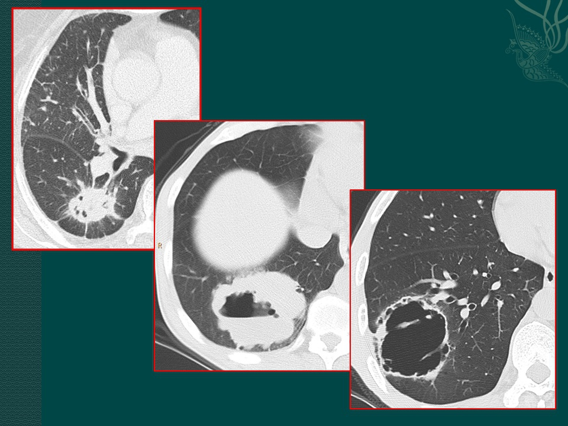
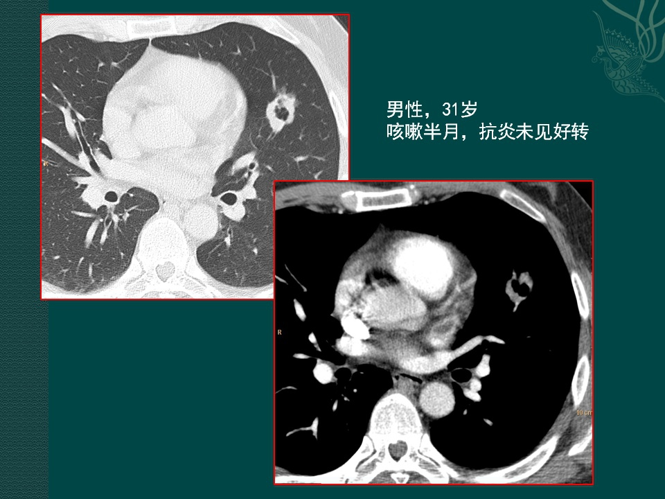
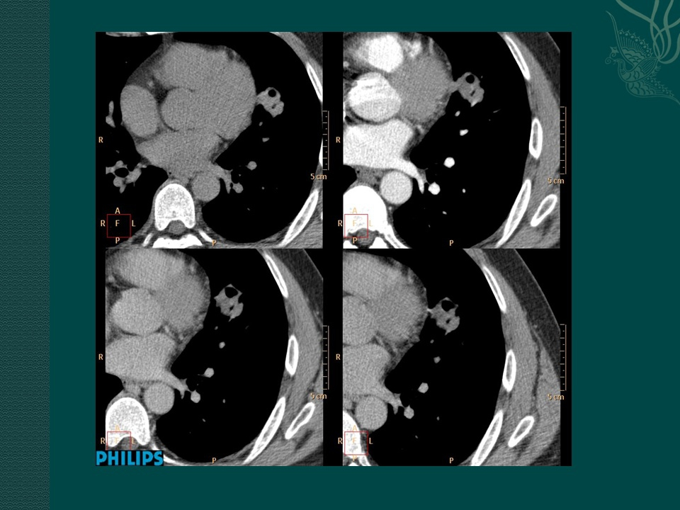

# 空洞型肺癌的影像鉴别诊断
山东省肿瘤医院影像科 黄勇
## 肺空洞的定义
> 空洞:病变内组织坏死后，经支气管排出后形成
> 空洞长径＞5mm，壁厚＞1mm
> 空泡:＜5mm，也称为“小泡征”，病理为没有被肿瘤侵犯的含气肺泡

- 第一是肺腺癌，有毛刺，小空泡。
- 第二是肺癌厚壁空洞，肺癌坏死形成
- 第三是薄壁空洞，有分隔，活瓣作用形成，假大空

## 提纲
- 发病年龄与空洞大小
- 空洞型肺转移瘤
- 如何鉴别鳞癌和腺癌空洞
- 肺癌空洞形成和预后及与基因突变的关系

## 发病年龄
> - 30-35岁以下肺癌少见
>-  30-35岁以下肺癌空洞罕见
> - 山东省肿瘤医院152例空洞型肺癌，＜35岁2例，其中＜30岁一例
> - 35岁以下肺空洞，绝大多数为良性，以结核居多(成人结核40%发生空洞)

很容易误诊肺癌，空洞内分隔、边缘有毛刺。但是年龄只有31岁。

通过平扫及三期动态增强发现洞壁无强化。手术病理:结核球，说明年龄很重要。

##空洞的大小
- 病灶长径＜2cm的空洞型肺癌罕见:
    - 山东省肿瘤医院152例，只有4例＜2cm(3%)
- 小于2cm的空洞以结核多见，其次为真菌和感染性病变
- 病理基础:小肺癌坏死相对少见，极少形成空洞。

